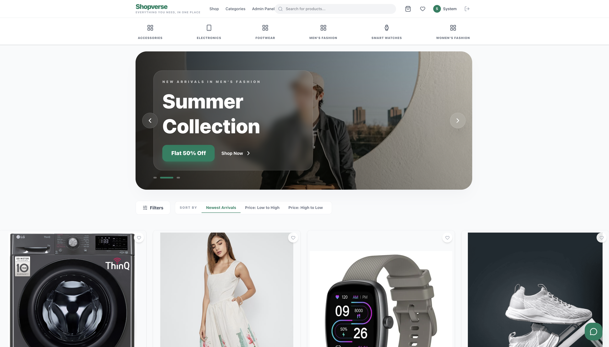
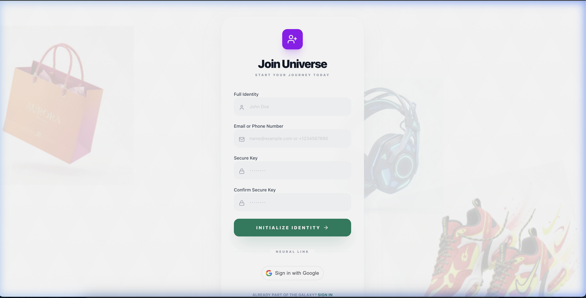
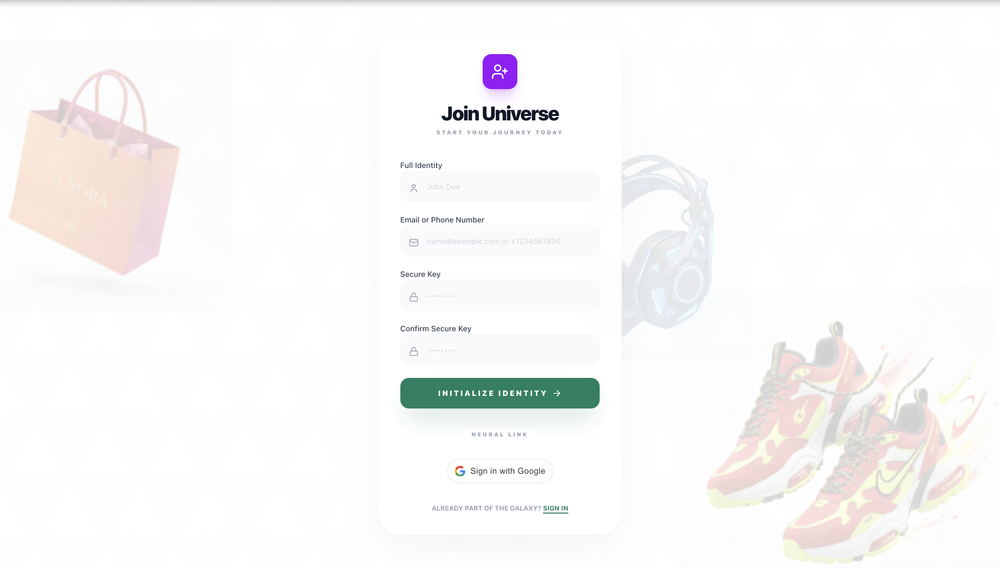
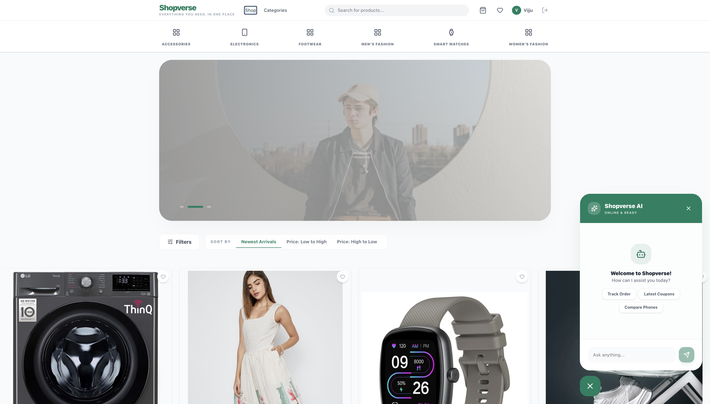
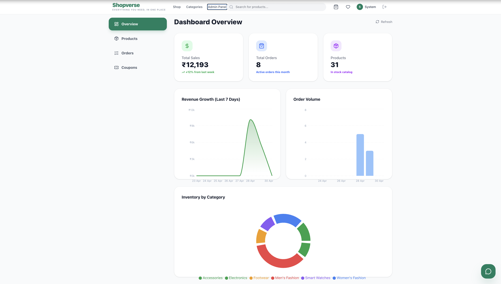

# 🌌 Shopverse | Premium AI eCommerce Platform

Shopverse is a state-of-the-art, full-stack eCommerce ecosystem designed for speed, security, and a premium user experience. Built with **FastAPI**, **React**, and **MongoDB**, it features AI-powered customer support and a robust multi-channel identity system.

---

## 📸 Visual Tour

<div align="center">
  <h3>✨ Home Experience</h3>
  
  <br/><br/>
  
  <table>
    <tr>
      <td width="33%">
        <p align="center"><b>🔐 Secure Access</b></p>
        
      </td>
      <td width="33%">
        <p align="center"><b>📝 Identity Creation</b></p>
        
      </td>
      <td width="33%">
        <p align="center"><b>🤖 AI Intelligence</b></p>
        
      </td>
    </tr>
  </table>
  
  <br/>
  <h3>🛠️ Admin Control Center</h3>
  
</div>

---

## 🚀 Key Features

- **🔐 Advanced Identity Engine**: Secure login/signup via **Email, Phone, or Google OAuth**, protected by **Two-Step Verification (OTP)**.
- **🤖 Gemini AI Support**: Real-time, context-aware AI assistant integrated using **Google Gemini Flash 1.5**.
- **⚡ High-Performance Catalog**: Fuzzy search, multi-criteria filtering, and instant sorting powered by **MongoDB Indexes**.
- **🎨 Premium UI/UX**: A glassmorphic design system built with **Tailwind CSS** and **Framer Motion** for 3D-styled animations.
- **🛡️ Secure Transactions**: Integrated **Razorpay** payment gateway with atomic order processing.
- **📊 Admin Control Center**: Real-time business analytics and inventory management dashboard.

---

## 🛠️ Technical Architecture

### **Backend**
- **Framework**: FastAPI (Python 3.11+)
- **Database**: MongoDB Atlas with **Beanie ODM**
- **Security**: JWT Stateless Auth + Argon2 Hashing
- **Concurrency**: Asynchronous Event Loop architecture

### **Frontend**
- **Library**: React 18+ (TypeScript)
- **State Management**: Zustand (Stateless & Persistent)
- **Animations**: Framer Motion
- **Styling**: Tailwind CSS (Modern Glassmorphism)

---

## ⚙️ Installation & Setup

### **1. Backend Setup**
```bash
cd backend
python -m venv venv
source venv/bin/activate
pip install -r requirements.txt
uvicorn app.main:app --reload
```

### **2. Frontend Setup**
```bash
cd frontend
npm install
npm run dev
```

---

## 🔒 Security Best Practices
This project implements:
- **Environment Isolation**: Secrets are never committed to version control.
- **CORS Protection**: Restricted API access.
- **TTL Indexes**: Automatic cleanup of transient verification data.

---

<div align="center">
  <p>Built with ❤️ by <b>Viswa Brahmanavarun</b></p>
</div>
